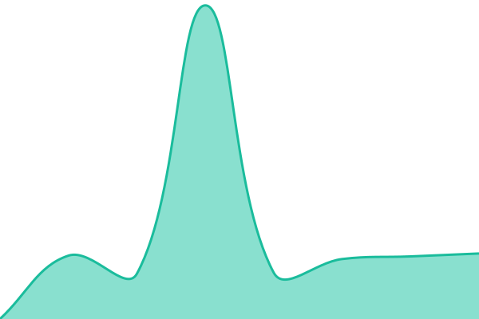

# [📈 Live Status](https://uptime.martinstam.nl): <!--live status--> **🟩 All systems operational**

This repository contains the open-source uptime monitor and status page for [MS Internet Commissie](https://uptime.martinstam.nl), powered by [Upptime](https://github.com/upptime/upptime).

With [Upptime](https://upptime.js.org), you can get your own unlimited and free uptime monitor and status page, powered entirely by a GitHub repository. We use [Issues](https://github.com/MS-Internet-Commissie/Uptime/issues) as incident reports, [Actions](https://github.com/MS-Internet-Commissie/Uptime/actions) as uptime monitors, and [Pages](https://uptime.martinstam.nl) for the status page.

<!--start: status pages-->
<!-- This summary is generated by Upptime (https://github.com/upptime/upptime) -->
<!-- Do not edit this manually, your changes will be overwritten -->
<!-- prettier-ignore -->
| URL | Status | History | Response Time | Uptime |
| --- | ------ | ------- | ------------- | ------ |
|  [Wordpress](https://martinistam.nl) | 🟩 Up | [wordpress.yml](https://github.com/MS-Internet-Commissie/Uptime/commits/HEAD/history/wordpress.yml) | 

 1233ms
     
 | 

<a href="https://MS-Internet-Commissie.github.io/Uptime/history/wordpress">100.00%</a>
    

|  [Forum](https://forum.martinistam.nl) | 🟩 Up | [forum.yml](https://github.com/MS-Internet-Commissie/Uptime/commits/HEAD/history/forum.yml) | 

 997ms
     
 | 

<a href="https://MS-Internet-Commissie.github.io/Uptime/history/forum">100.00%</a>
    

|  [Admin panel](https://admin.martinistam.nl) | 🟩 Up | [admin-panel.yml](https://github.com/MS-Internet-Commissie/Uptime/commits/HEAD/history/admin-panel.yml) | 

 529ms
     
 | 

<a href="https://MS-Internet-Commissie.github.io/Uptime/history/admin-panel">100.00%</a>
    

|  [Agenda Sync](https://agendasync.martinistam.nl) | 🟩 Up | [agenda-sync.yml](https://github.com/MS-Internet-Commissie/Uptime/commits/HEAD/history/agenda-sync.yml) | 

 651ms
     
 | 

<a href="https://MS-Internet-Commissie.github.io/Uptime/history/agenda-sync">100.00%</a>
    

|  [File Browser](https://admin.martinistam.nl/files) | 🟩 Up | [file-browser.yml](https://github.com/MS-Internet-Commissie/Uptime/commits/HEAD/history/file-browser.yml) | 

 862ms
     
 | 

<a href="https://MS-Internet-Commissie.github.io/Uptime/history/file-browser">100.00%</a>
    

|  [Portainer](https://admin.martinistam.nl/portainer) | 🟩 Up | [portainer.yml](https://github.com/MS-Internet-Commissie/Uptime/commits/HEAD/history/portainer.yml) | 

 1127ms
     
 | 

<a href="https://MS-Internet-Commissie.github.io/Uptime/history/portainer">100.00%</a>
    

|  [Mailgun](smtp.eu.mailgun.org) | 🟩 Up | [mailgun.yml](https://github.com/MS-Internet-Commissie/Uptime/commits/HEAD/history/mailgun.yml) | 

 9ms
     
 | 

<a href="https://MS-Internet-Commissie.github.io/Uptime/history/mailgun">100.00%</a>
    

<!--end: status pages-->

[**Visit our status website →**](https://uptime.martinstam.nl)

## 📄 License

- Powered by: [Upptime](https://github.com/upptime/upptime)
- Code: [MIT](./LICENSE) © [Anand Chowdhary](https://anandchowdhary.com), supported by [Pabio](https://pabio.com)
- Data in the `./history` directory: [Open Database License](https://opendatacommons.org/licenses/odbl/1-0/)
